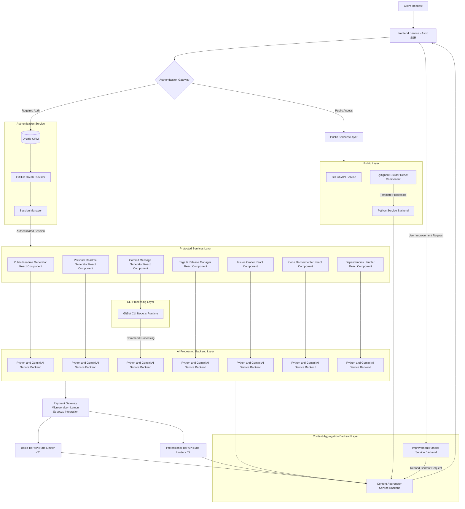

<div align="center">
   <a href="https://github.com/gitset-dev" target="_blank">
        
    </a>
    <br>
    <a href="https://github.com/gitset-dev" target="_blank">
        
    </a>
</div>

<div align="center">
    <h3>
        <a href="https://gitset.dev" target="_blank">
            GitSet.dev - Advanced AI-Driven GitHub Tools Suite.
        </a>
    </h3>
</div>

<hr>

<strong>GitSet.dev</strong> is a comprehensive suite of <strong>AI-driven</strong> tools that enhances your GitHub development experience. It provides solutions for streamlined repository management, precise versioning, and clear documentation. Built with   <strong>Astro.js/React.js</strong>, and integrating <strong>8 Python-based backends (FastAPI and Flask)</strong>, it combines AI-powered suggestions with user-requested improvements, continuously refining results to deliver optimized outcomes. It offers both public utilities and authenticated services to streamline repository management, documentation, version control tasks and more.

<div align="center">
  
</div>

### Core Features

#### Desktop Application
Gitset.dev is available as a desktop application for Windows, macOS, and Linux, providing the same powerful features as the web version in a convenient standalone format. The desktop application is built using Electron and follows the same versioning scheme as the web application. Updates to the desktop app are released concurrently with the web version to maintain feature parity across all platforms. Visit our [download page](https://gitset.dev/download) to get the desktop application for your operating system.

#### Public Tools (No Authentication Required):
- **.gitignore Builder:** Automatically generates customized .gitignore files tailored to specific languages and frameworks. Users can easily select the desired tech stack, and the tool combines relevant rules to create an optimized .gitignore file. This eliminates the need for manual template searches, ensuring clean and efficient repository management with minimal effort. Ideal for developers working across multiple technologies, this tool simplifies the process of maintaining tidy codebases.

#### Authenticated Services:
- **Issues Crafter:** Streamlines the process of managing GitHub issues by leveraging AI to generate structured, context-aware issue descriptions and automate routine tasks. It enhances issue tracking through intelligent classification, prioritization, and progress monitoring. Designed for developers and project teams, it enables efficient collaboration, reduces manual overhead, and ensures consistency across project workflows, making it an essential tool for maintaining productivity in agile development environments.

- **Pull Requests Maker:** Manages the complete pull request lifecycle from branch comparison to merge completion. This comprehensive tool enables branch comparison, generates AI-powered PR descriptions based on commit messages and file changes, and facilitates collaborative code review processes. It supports draft PR creation, assignee and reviewer management, bulk labeling operations, and detailed analytics showing commits, file changes, and review history. The tool streamlines merge operations with conflict resolution support, ensuring efficient code integration while maintaining high-quality standards and consistent documentation practices across development teams.

- **Public AI-Readme Generator:** Automatically generates professional README.md files for any public GitHub repository. By analyzing repository content, it creates comprehensive documentation, including features, installation guides, usage instructions, and contribution guidelines. Users can request modifications to the initial generated README, receiving different versions based on specific requirements. Additionally, the tool allows users to compare versions, ensuring that the final README perfectly aligns with the project’s needs and presentation standards.

- **Personal AI-Readme Generator:** Similar to the Public AI-Readme Generator, but for both public and private repositories that authenticated users own. It generates detailed README.md files, covering all essential sections of project documentation. Users can refine the initial output by requesting adjustments, receiving multiple iterations based on their preferences. The tool also supports comparing different versions of the README, making it easy to select the most appropriate one for the project. This flexibility ensures that both private and public repositories have high-quality, customizable documentation.

- **Commit Messages Generator:** Enhances Git operations through a command-line interface (CLI) that utilizes AI to automatically generate contextually accurate commit messages. Powered by Google’s Gemini Pro AI technology, the tool analyzes staged changes and provides commit suggestions based on semantic versioning or custom user-defined styles. It adapts to existing commit patterns to ensure consistent formatting in team environments. Optimized for efficiency, the tool delivers rapid message generation while minimizing resource usage, and supports cross-platform integration for consistent performance across various systems.

- **Tags & Releases Manager:** Simplifies release management by providing tools to create, edit, and manage GitHub tags and releases through a streamlined interface. It integrates AI-powered suggestions for release notes that accurately reflect code changes, allowing fine-tuning to meet specific requirements. The tool ensures a more efficient and consistent release process, reducing manual effort and providing developers with a reliable solution for managing versioning and releases within the development cycle.

- **Code Decommenter:** Processes source code to remove unnecessary comments, improving readability and optimizing the code for production. It supports multiple programming languages and allows selective removal of inline, block, documentation, and pragma comments based on user-defined parameters. The tool efficiently parses code, ensuring that functionality remains intact while reducing clutter. Ideal for maintaining clean codebases and streamlining automated processing in development workflows.

- **Dependencies Handler** Streamlines dependency management across multiple programming languages. It analyzes codebases to identify external dependencies, organizes imports following best practices, and generates configuration files for dependency management. Supported languages include Python, Java, C/C++, and Rust. The tool produces files such as `requirements.txt`, `pom.xml`, `Cargo.toml`, and `CMakeLists.txt`, ensuring efficient and standardized project setups. Ideal for multi-language repositories and maintaining clean, well-structured code.

### Technical Architecture

Based on a modular, service-oriented architecture, it employs distinct service layers to manage client requests, authentication, AI-driven processing, content aggregation, and improvement handling. The design follows best practices for scalability, performance, and security, ensuring a clear separation of concerns between public and protected services.



<div align="center">

#### View this graph in an interactive editor [here](https://www.mermaidchart.com/raw/8005bb23-8f1a-4c4c-b31e-945062eb6364?theme=light&version=v0.1&format=svg).
</div>

---

### Layer Descriptions

#### Frontend Layer
- **Entry Point:** Built with Astro SSR and React.js, it manages user interactions, content rendering, and communication with other services.

#### Authentication System
- **Authentication Gateway**: 
  - Functions as the security checkpoint, routing requests based on the authentication status of users.
  - Enforces access control policies and ensures secure request handling by interfacing with the authentication service.

- **Authentication Service**: 
  - Utilizes Drizzle ORM for database interaction, providing persistent storage for user data.
  - Integrates GitHub OAuth for user authentication, managing session tokens and ensuring secure user identification.
  - The session manager is responsible for managing the lifecycle of user sessions.

#### CLI Processing Layer
- **GitSet CLI:** Is an integral component of the GitSet.dev ecosystem, designed to enhance Git workflow automation through AI-driven commit message generation. By leveraging Google's Gemini Pro AI technology, it provides intelligent analysis of staged changes to generate contextually appropriate commit messages, supporting both semantic and personalized formatting styles.

#### Protected Services Layer
- **Core Services:** Includes README generation, commit message creation, version control, issues, and code decommenting.

#### AI Processing Backend Layer
- **Parallelized AI Services:** Multiple Gemini AI instances handle specific tasks efficiently, ensuring scalability.

#### Public Services Layer
- **Public Tools:** Includes GitHub API integration and `.gitignore` builder.

#### Content Management Layer
- **Content Aggregator:** Normalizes and delivers content from various sources.
- **Improvement Handler:** Processes user feedback for content refinement.

---

#### Payment Processing & Rate Limiting:

#### Lemon Squeezy Integration & Request Tracking
The payment system implements a tier-based access control mechanism that operates across multiple layers:

- **Payment Processing (Lemon Squeezy Layer):**
  - Handles subscription management and payment processing
  - Communicates plan changes via webhooks
  - Maintains billing and subscription data separately from usage tracking

- **Usage Tracking (Python Backends):**
  - Each Python backend maintains its own protected request counter.
  - Request tracking is isolated from payment data and OAuth authentication.
  - Counters are stored securely and independently of Drizzle ORM user data.
  - Rate limits are enforced per service:
    - Basic Plan (T1): Feature-specific limits.
    - Professional Plan (T2): Unlimited access.

- **Request Flow:**
  1. Backend validates request tier (`basic`/`pro`) via authentication token.
  2. Service-specific counter checks remaining quota.
  3. Request processed if quota allows.
  4. Counter updated atomically after successful processing.

- **Security Considerations:**
  - Usage tracking is isolated from payment processing.
  - Authentication data (GitHub OAuth/Drizzle ORM) remains separate.
  - Each service maintains independent rate limiting.

### Technical Considerations
- **Scalability**: The system ensures horizontal scalability with independent scaling of AI processing units, as well as the distributed handling of public and protected service layers. Each layer can scale independently based on demand.
  
- **Security**: The authentication gateway serves as the primary security checkpoint, ensuring that only authenticated requests can access protected services. OAuth-based authentication ensures secure user identification and session management.
  
- **Performance**: The use of parallel AI processing, combined with a robust content aggregation system, ensures that the system can efficiently process and deliver content. The public and protected services are optimized for minimal latency.

- **Integration Points**: 
  - Integration with GitHub for authentication and API access.
  - Gemini AI services for advanced content generation and analysis.
  - Python backend (FastAPI and Flask): Handles template-based processing and AI-driven request handling and response delivery.
  - SSR frontend ensures dynamic rendering of content based on user interaction.

---

### Frontend Installation

1. Clone the repository:
   ```bash
   git clone https://github.com/imprvhub/gitset.git
   ```

2. Navigate to the project directory:
   ```bash
   cd gitset
   ```

3. Install the required dependencies:
   ```bash
   npm install
   ```

### Usage

1. Run `npm run dev` to start the development server.
2. Access the application in your browser at `http://localhost:4321`.

### Frontend Dependencies

- **Astro:** A static site generator with server-side rendering capabilities.
- **React:** A JavaScript library for building user interfaces.
- **TypeScript:** A superset of JavaScript that adds optional static typing.
- **lucide-react:** A set of customizable SVG icons for React.
- **react-icons/fa:** A set of Font Awesome icons for React.
- **diff:** A library for generating unified diffs.

### Contributing

1. Fork the repository
2. Create your feature branch (`git checkout -b feature/AmazingFeature`)
3. Commit your changes (`git commit -m 'Add some AmazingFeature'`)
4. Push to the branch (`git push origin feature/AmazingFeature`)
5. Open a Pull Request

### License

For more information regarding this topic please read the following [Terms and Conditions Section.](https://gitset.dev/terms)