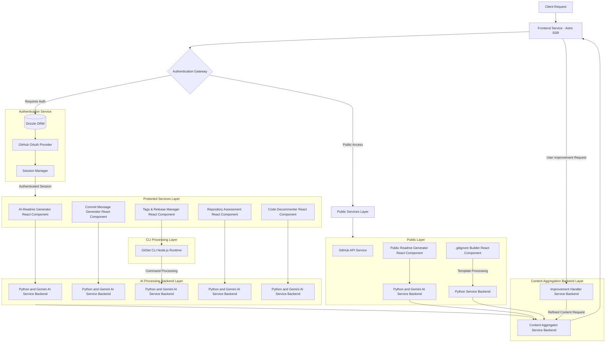

## GitSet.dev - Smart AI Docs & Versioning for GitHub Repositories.

**GitSet.dev** is a powerful suite of tools built to streamline your Git-related workflows and documentation processes. It blends AI-powered suggestions with user-requested improvements, continuously refining results to deliver customized, optimized outcomes.

### Core Features

Encompasses various features, including:

#### For Public Users:
- **Public AI-Readme Generator:** Craft a README.md file featuring concise documentation from any chosen public repository.
- **.gitignore Builder:** Choose multiple languages, frameworks, and tools to generate a comprehensive .gitignore file tailored to your codebase. Adjust settings and combine selections as needed.

#### For Authenticated Users:
- **Personal AI-Readme Generator:** Craft a README.md file with concise documentation from any public or private repository you own.
- **Commit Messages Generator:** Generate semantic commit messages through automated code analysis. (Auth required).
- **Tags & Releases Manager:** Manage your project's versioning with a streamlined interface. Create, edit, delete and track Tags & Releases with AI-driven suggestions for release notes. It has the ability to generate release notes for your project and improve them after you review them.
- **Code Decommenter:** Clean your code by removing specified types of comments. Select which comments to remove (single-line, multi-line, documentation, or pragma comments) and receive processed code ready for manual implementation.
- **Repository Assessment Tool:** Get comprenhensive valuations and effort breakdowns for your established repositories. You'll receive repository complexity insights, code analysis, development time calculations, resource allocation metrics, and precise cost estimations based on various experience levels and market factors.

### Technical Architecture

Based on a modular, service-oriented architecture, it employs distinct service layers to manage client requests, authentication, AI-driven processing, content aggregation, and improvement handling. The design follows best practices for scalability, performance, and security, ensuring a clear separation of concerns between public and protected services.

See this graph online [here](https://www.mermaidchart.com/app/projects/39cc778e-2704-4a81-b724-1d32f4f7c6b0/diagrams/c94b9161-a7b7-472c-86b1-d269e7874fd9/version/v0.1/whiteboard).



---

#### Frontend Layer
- **Primary Entry Point**: The frontend service, built on Astro SSR with React.js integration, acts as the main entry point for client requests. It handles user interaction, manages content rendering, and coordinates with both public and protected service layers for data delivery.
- **Responsibilities**: 
  - State management and content rendering
  - User authentication and session handling
  - Interaction with public and protected services for data access

#### Authentication System
- **Authentication Gateway**: 
  - Functions as the security checkpoint, routing requests based on the authentication status of users.
  - Enforces access control policies and ensures secure request handling by interfacing with the authentication service.

- **Authentication Service**: 
  - Utilizes Drizzle ORM for database interaction, providing persistent storage for user data.
  - Integrates GitHub OAuth for user authentication, managing session tokens and ensuring secure user identification.
  - The session manager is responsible for managing the lifecycle of user sessions.

#### CLI Processing Layer
- **GitSet CLI**: 
  - Node.js-based command-line interface that acts as an intermediary processing layer
  - Handles command interpretation and execution for the Tags & Release Manager
  - Provides local environment integration for version control operations
  - Facilitates secure communication between the frontend interface and AI backend services
  - Processes Git commands and metadata before sending to the AI service for analysis

#### Protected Services Layer
This layer comprises five core services, which require authentication:
1. **AI-Readme Generator Service**: 
   - Utilizes Gemini AI to generate detailed, context-aware README files.
   
2. **Commit Message Generator Service**: 
   - Leverages contextual analysis via Gemini AI to automate commit message creation.

3. **Tags & Release Manager Service**: 
   - Manages version control, automatic release note generation, and tagging.

4. **Repository Assessment Service**: 
   - Provides repository health assessments, analyzing various metrics and insights, powered by Gemini AI.

5. **Code Decommenter Service**: 
   - Processes and removes specified types of comments from source code.
   - Supports multiple comment types: single-line, multi-line, documentation, and pragma comments.
   - Provides clean, formatted output for manual implementation.
   - Ensures code functionality remains intact while removing unnecessary documentation.

#### AI Processing Backend Layer
- This layer implements parallelized AI processing through multiple instances of the Gemini AI backend, with each instance dedicated to specific tasks (e.g., README generation, commit message generation, release management, repository assessment, code comment removal).
- The backend processes requests efficiently and in parallel, ensuring scalability and performance.
- Each service maintains its own AI processing pipeline to prevent interference and optimize response times.

#### Public Services Layer
The public services layer is accessible without authentication, providing the following functionalities:
1. **GitHub API Service**: 
   - Handles GitHub integration, offering a public access endpoint for interacting with GitHub repositories.

2. **Public Readme Generator**: 
   - A simplified version of the README generation service, using the public AI backend to generate basic readme files.

3. **.gitignore Builder Service**: 
   - Generates `.gitignore` files based on predefined templates, with processing handled by the Python backend.

4. **Support Services**: 
   - Includes public-facing AI processing through the Gemini backend and Python services for template-based tasks.

#### Content Management Layer
- **Content Aggregator Service**: 
   - Collects content from various sources (AI processing, public services, and Python backend) and normalizes it into a unified format.
   - Facilitates content fusion, formatting, and preparation for frontend delivery.
   
- **Improvement Handler Service**: 
   - Manages user-generated improvement requests, coordinating with the content aggregator to refine and iterate on content.

### Data Flow and Technical Considerations

The system is designed to efficiently handle user requests while maintaining security, performance, and scalability.

#### Authentication Flow
1. The client makes an initial request, which is handled by the frontend service.
2. The frontend routes the request through the authentication gateway to determine if the user is authenticated.
3. Upon successful authentication, the user session is established, and the user is granted access to the protected services layer.

#### Service Flow (Protected and Public)
- **Protected Services**: Once authenticated, users can access the protected services. These services interact with their dedicated Gemini AI backend for specific tasks (e.g., managing tags & releases, generating commit messages, removing code comments). The backend processes the requests and returns aggregated results to the frontend.
  
- **Public Services**: These services, which do not require authentication, process user requests and send the output through the aggregation layer. The content is then delivered to the frontend.

#### Content Aggregation and Improvement Flow
1. Content is generated through the AI processing units or public services and is aggregated by the content aggregator.
2. User requests for improvements are routed to the improvement handler, which works with the content aggregator to refine and iterate the content based on user feedback.
3. The refined content is then sent back to the frontend for presentation to the user.

### Technical Considerations
- **Scalability**: The system ensures horizontal scalability with independent scaling of AI processing units, as well as the distributed handling of public and protected service layers. Each layer can scale independently based on demand.
  
- **Security**: The authentication gateway serves as the primary security checkpoint, ensuring that only authenticated requests can access protected services. OAuth-based authentication ensures secure user identification and session management.
  
- **Performance**: The use of parallel AI processing, combined with a robust content aggregation system, ensures that the system can efficiently process and deliver content. The public and protected services are optimized for minimal latency.

- **Integration Points**: 
  - Integration with GitHub for authentication and API access.
  - Gemini AI services for advanced content generation and analysis.
  - Python backend for template-based processing.
  - SSR frontend ensures dynamic rendering of content based on user interaction.

---

### Frontend Installation

1. Clone the repository:
   ```bash
   git clone https://github.com/imprvhub/gitset.git
   ```

2. Navigate to the project directory:
   ```bash
   cd gitset
   ```

3. Install the required dependencies:
   ```bash
   npm install
   ```

### Usage

1. Run `npm run dev` to start the development server.
2. Access the application in your browser at `http://localhost:4321`.

### Frontend Dependencies

- **Astro:** A static site generator with server-side rendering capabilities.
- **React:** A JavaScript library for building user interfaces.
- **TypeScript:** A superset of JavaScript that adds optional static typing.
- **lucide-react:** A set of customizable SVG icons for React.
- **react-icons/fa:** A set of Font Awesome icons for React.
- **diff:** A library for generating unified diffs.

### Contributing

1. Fork the repository
2. Create your feature branch (`git checkout -b feature/AmazingFeature`)
3. Commit your changes (`git commit -m 'Add some AmazingFeature'`)
4. Push to the branch (`git push origin feature/AmazingFeature`)
5. Open a Pull Request

### License

For more information regarding this topic please read the following [Terms and Conditions Section.](https://gitset.dev/terms)