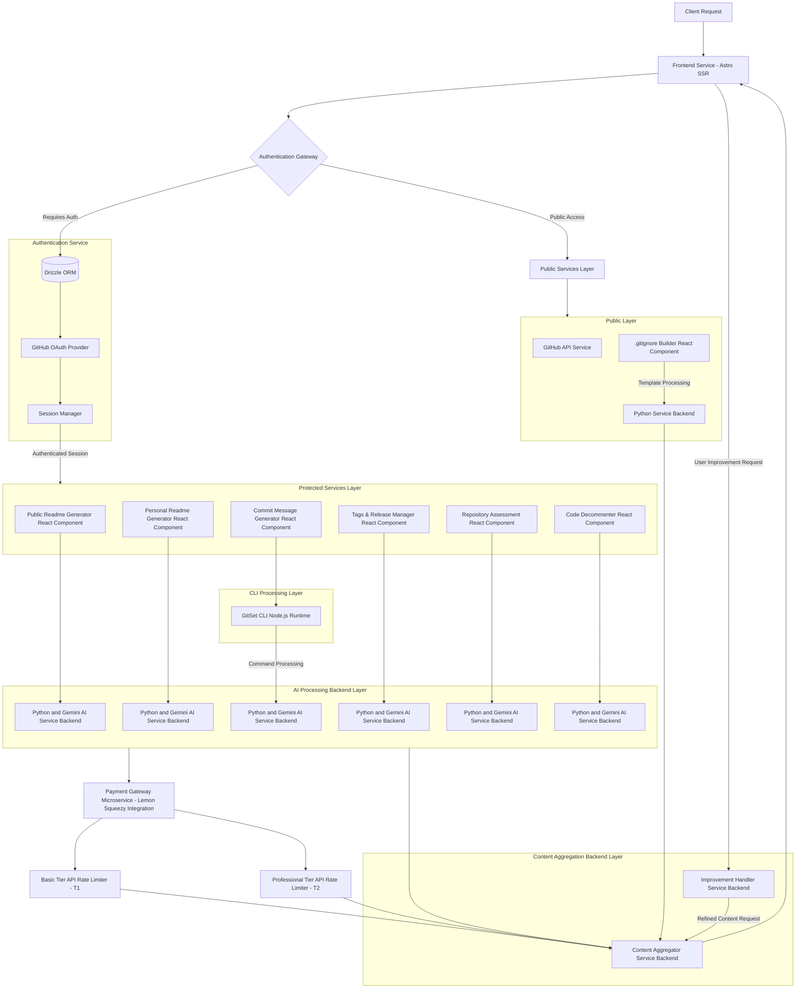

<div align="center">
   <a href="https://github.com/gitset-dev" target="_blank">
        
    </a>
    <br>
    <a href="https://github.com/gitset-dev" target="_blank">
        
    </a>
</div>

<div align="center">
    <h3>
        <a href="https://gitset.dev" target="_blank">
            GitSet.dev - Advanced AI-Driven GitHub Tools Suite.
        </a>
    </h3>
</div>

<hr>

<strong>GitSet.dev</strong> is a comprehensive suite of <strong>AI-driven</strong> tools that enhances your GitHub development experience. It provides solutions for streamlined repository management, precise versioning, and clear documentation. Built with   <strong>Astro.js/React.js</strong>, and integrating <strong>8 Python-based backends (FastAPI and Flask)</strong>, it combines AI-powered suggestions with user-requested improvements, continuously refining results to deliver optimized outcomes. It offers both public utilities and authenticated services to streamline repository management, documentation, version control tasks and more.

<div align="center">
  
</div>

### Core Features

#### Public Tools (No Authentication Required):
- **.gitignore Builder:** Creates customized `.gitignore` files for multiple languages and frameworks.

#### Authenticated Services:
- **Public AI-Readme Generator:** Generates README.md files for public GitHub repositories.
- **Personal AI-Readme Generator:** Generates README.md files for both public and private repositories of authenticated users.
- **Commit Messages Generator:** Suggests semantic or custom commit messages for staged Git files (_requires GitSet CLI_).
- **Tags & Releases Manager:** Simplifies version control with AI-driven release note suggestions and tagging.
- **Code Decommenter:** Removes specified comments while preserving functionality across multiple programming languages.
- **Repository Assessment Tool:** Provides detailed evaluations and metrics for repositories.

### Technical Architecture

Based on a modular, service-oriented architecture, it employs distinct service layers to manage client requests, authentication, AI-driven processing, content aggregation, and improvement handling. The design follows best practices for scalability, performance, and security, ensuring a clear separation of concerns between public and protected services.



<div align="center">

#### View this graph in an interactive editor [here](https://www.mermaidchart.com/app/projects/39cc778e-2704-4a81-b724-1d32f4f7c6b0/diagrams/38be8b13-45a9-4a4b-9b8b-ccf8bcc362d5/version/v0.1/edit).
</div>

---

### Layer Descriptions

#### Frontend Layer
- **Entry Point:** Built with Astro SSR and React.js, it manages user interactions, content rendering, and communication with other services.

#### Authentication System
- **Authentication Gateway**: 
  - Functions as the security checkpoint, routing requests based on the authentication status of users.
  - Enforces access control policies and ensures secure request handling by interfacing with the authentication service.

- **Authentication Service**: 
  - Utilizes Drizzle ORM for database interaction, providing persistent storage for user data.
  - Integrates GitHub OAuth for user authentication, managing session tokens and ensuring secure user identification.
  - The session manager is responsible for managing the lifecycle of user sessions.

#### CLI Processing Layer
- **GitSet CLI:** Is an integral component of the GitSet.dev ecosystem, designed to enhance Git workflow automation through AI-driven commit message generation. By leveraging Google's Gemini Pro AI technology, it provides intelligent analysis of staged changes to generate contextually appropriate commit messages, supporting both semantic and personalized formatting styles.

#### Protected Services Layer
- **Core Services:** Includes README generation, commit message creation, version control, repository assessment, and code decommenting.

#### AI Processing Backend Layer
- **Parallelized AI Services:** Multiple Gemini AI instances handle specific tasks efficiently, ensuring scalability.

#### Public Services Layer
- **Public Tools:** Includes GitHub API integration and `.gitignore` builder.

#### Content Management Layer
- **Content Aggregator:** Normalizes and delivers content from various sources.
- **Improvement Handler:** Processes user feedback for content refinement.

---

#### Payment Processing & Rate Limiting:

#### Lemon Squeezy Integration & Request Tracking
The payment system implements a tier-based access control mechanism that operates across multiple layers:

- **Payment Processing (Lemon Squeezy Layer):**
  - Handles subscription management and payment processing
  - Communicates plan changes via webhooks
  - Maintains billing and subscription data separately from usage tracking

- **Usage Tracking (Python Backends):**
  - Each Python backend maintains its own protected request counter.
  - Request tracking is isolated from payment data and OAuth authentication.
  - Counters are stored securely and independently of Drizzle ORM user data.
  - Rate limits are enforced per service:
    - Basic Plan (T1): Feature-specific limits.
    - Professional Plan (T2): Unlimited access.

- **Request Flow:**
  1. Backend validates request tier (`basic`/`pro`) via authentication token.
  2. Service-specific counter checks remaining quota.
  3. Request processed if quota allows.
  4. Counter updated atomically after successful processing.

- **Security Considerations:**
  - Usage tracking is isolated from payment processing.
  - Authentication data (GitHub OAuth/Drizzle ORM) remains separate.
  - Each service maintains independent rate limiting.

### Technical Considerations
- **Scalability**: The system ensures horizontal scalability with independent scaling of AI processing units, as well as the distributed handling of public and protected service layers. Each layer can scale independently based on demand.
  
- **Security**: The authentication gateway serves as the primary security checkpoint, ensuring that only authenticated requests can access protected services. OAuth-based authentication ensures secure user identification and session management.
  
- **Performance**: The use of parallel AI processing, combined with a robust content aggregation system, ensures that the system can efficiently process and deliver content. The public and protected services are optimized for minimal latency.

- **Integration Points**: 
  - Integration with GitHub for authentication and API access.
  - Gemini AI services for advanced content generation and analysis.
  - Python backend (FastAPI and Flask): Handles template-based processing and AI-driven request handling and response delivery.
  - SSR frontend ensures dynamic rendering of content based on user interaction.

---

### Frontend Installation

1. Clone the repository:
   ```bash
   git clone https://github.com/imprvhub/gitset.git
   ```

2. Navigate to the project directory:
   ```bash
   cd gitset
   ```

3. Install the required dependencies:
   ```bash
   npm install
   ```

### Usage

1. Run `npm run dev` to start the development server.
2. Access the application in your browser at `http://localhost:4321`.

### Frontend Dependencies

- **Astro:** A static site generator with server-side rendering capabilities.
- **React:** A JavaScript library for building user interfaces.
- **TypeScript:** A superset of JavaScript that adds optional static typing.
- **lucide-react:** A set of customizable SVG icons for React.
- **react-icons/fa:** A set of Font Awesome icons for React.
- **diff:** A library for generating unified diffs.

### Contributing

1. Fork the repository
2. Create your feature branch (`git checkout -b feature/AmazingFeature`)
3. Commit your changes (`git commit -m 'Add some AmazingFeature'`)
4. Push to the branch (`git push origin feature/AmazingFeature`)
5. Open a Pull Request

### License

For more information regarding this topic please read the following [Terms and Conditions Section.](https://gitset.dev/terms)