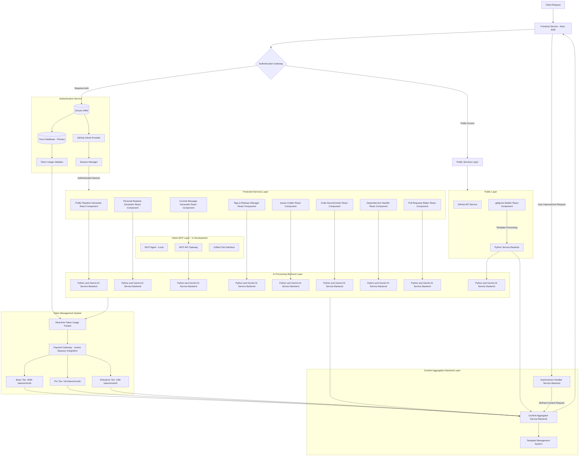

   
     
    

    <h3>
        <a href="https://gitset.dev" target="_blank">
            Gitset.dev - Advanced AI-Driven GitHub Tools Suite.
        </a>
    </h3>

<strong>Gitset.dev</strong> is a suite of AI-driven tools that enhances your GitHub development experience. From streamlined repository management and precise versioning to smart documentation and collaborative review processes, Through continuous refinement based on AI suggestions and user feedback, every contribution is elevated to its best possible version.

  

### Core Features

#### Gitset MCP (Model Context Protocol)
The next generation of Gitset development tools, currently in active development. Gitset MCP will unify all 9 platform capabilities into a single, intelligent agent that works seamlessly with your terminal and IDE. This revolutionary approach brings commit message generation, README creation, issue crafting, and all other tools directly to your development environment with advanced context awareness and team preference learning.

**Key MCP Features:**
- **Unified Experience**: All 9 tools accessible from a single interface
- **IDE Integration**: Native integration with popular IDEs like Cursor, VS Code, and more
- **Smart Context**: Advanced AI that understands your project context, coding patterns, and team preferences
- **Cross-Platform Token System**: Shared usage limits between web and local tools

#### Token-Based Usage System
Gitset operates on a fair, transparent token-based system that measures actual AI processing complexity rather than simple request counts:

**Usage Plans:**
- **Basic Plan**: 300,000 tokens/month (~120 operations) - **FREE**
- **Pro Plan**: 1,000,000 tokens/month (~400 operations) - $2.99/month
- **Enterprise Plan**: 10,000,000 tokens/month (~4,000 operations) - $19.99/month

**Token Consumption by Tool:**
| Tool | Token Range | Typical Operation |
|------|-------------|-------------------|
| Dependencies Analysis | 100-250 tokens | Package updates and import organization |
| Commit Message Generation | 500-2,000 tokens | Change analysis and descriptive messaging |
| Release Notes Generation | 800-2,500 tokens | Structured notes from commits |
| Issue Generation | 1,200-3,400 tokens | Structured issues with context |
| README Generation | 1,500-4,000 tokens | Comprehensive code-based documentation |
| Pull Request Generation | 1,500-3,500 tokens | PRs with descriptions and change summaries |
| Code Decommenting | 3,900-5,000 tokens | Comment removal while preserving structure |

#### Web Application Tools
Gitset.dev provides a comprehensive web-based platform with 9 AI-powered tools accessible through your browser. These tools are organized into public utilities and authenticated services, all integrated with the token-based usage system.

#### Public Tools (No Authentication Required):
- **.gitignore Builder:** Automatically generates customized .gitignore files tailored to specific languages and frameworks. Users can easily select the desired tech stack, and the tool combines relevant rules to create an optimized .gitignore file. This eliminates the need for manual template searches, ensuring clean and efficient repository management with minimal effort. Ideal for developers working across multiple technologies, this tool simplifies the process of maintaining tidy codebases.

#### Authenticated Services:

  

- **Tags & Releases Manager:** Simplifies release management by providing tools to create, edit, and manage GitHub tags and releases through a streamlined interface. It integrates AI-powered suggestions for release notes that accurately reflect code changes, allowing fine-tuning to meet specific requirements. The tool ensures a more efficient and consistent release process, reducing manual effort and providing developers with a reliable solution for managing versioning and releases within the development cycle.

- **.gitignore Builder:** Automatically generates customized .gitignore files tailored to specific languages and frameworks. Users can easily select the desired tech stack, and the tool combines relevant rules to create an optimized .gitignore file. This eliminates the need for manual template searches, ensuring clean and efficient repository management with minimal effort. Ideal for developers working across multiple technologies, this tool simplifies the process of maintaining tidy codebases.

  

- **Issues Crafter:** Streamlines the process of managing GitHub issues by leveraging AI to generate structured, context-aware issue descriptions and automate routine tasks. **Template support** enables users to define custom issue formats for consistent team workflows. It enhances issue tracking through intelligent classification, prioritization, and progress monitoring. Designed for developers and project teams, it enables efficient collaboration, reduces manual overhead, and ensures consistency across project workflows, making it an essential tool for maintaining productivity in agile development environments.

- **Pull Requests Maker:** Manages the complete pull request lifecycle from branch comparison to merge completion. This comprehensive tool enables branch comparison, generates AI-powered PR descriptions based on commit messages and file changes, and facilitates collaborative code review processes. **Custom template support** allows teams to maintain consistent PR formats and requirements. It supports draft PR creation, assignee and reviewer management, bulk labeling operations, and detailed analytics showing commits, file changes, and review history. The tool streamlines merge operations with conflict resolution support, ensuring efficient code integration while maintaining high-quality standards and consistent documentation practices across development teams.

  

- **Public AI-Readme Generator:** Automatically generates professional README.md files for any public GitHub repository. By analyzing repository content, it creates comprehensive documentation, including features, installation guides, usage instructions, and contribution guidelines. **Template system** allows users to define custom README structures and formats for consistent documentation across projects. Users can request modifications to the initial generated README, receiving different versions based on specific requirements. Additionally, the tool allows users to compare versions, ensuring that the final README perfectly aligns with the project's needs and presentation standards.

- **Personal AI-Readme Generator:** Similar to the Public AI-Readme Generator, but for both public and private repositories that authenticated users own. It generates detailed README.md files, covering all essential sections of project documentation. **Custom templates** enable consistent documentation standards across private repositories and teams. Users can refine the initial output by requesting adjustments, receiving multiple iterations based on their preferences. The tool also supports comparing different versions of the README, making it easy to select the most appropriate one for the project. This flexibility ensures that both private and public repositories have high-quality, customizable documentation.

- **Commit Messages Generator:** Enhances Git operations through integration with **Gitset MCP** (Model Context Protocol) that utilizes AI to automatically generate contextually accurate commit messages. Powered by Google's Gemini Pro AI technology, the tool analyzes staged changes and provides commit suggestions based on semantic versioning or custom user-defined styles. It adapts to existing commit patterns to ensure consistent formatting in team environments. Optimized for efficiency, the tool delivers rapid message generation while minimizing token usage, and supports cross-platform integration for consistent performance across various systems.

  

- **Code Decommenter:** Processes source code to remove unnecessary comments, improving readability and optimizing the code for production. It supports multiple programming languages and allows selective removal of inline, block, documentation, and pragma comments based on user-defined parameters. The tool efficiently parses code, ensuring that functionality remains intact while reducing clutter. Ideal for maintaining clean codebases and streamlining automated processing in development workflows.

- **Dependencies Handler:** Streamlines dependency management across multiple programming languages. It analyzes codebases to identify external dependencies, organizes imports following best practices, and generates configuration files for dependency management. Supported languages include Python, Java, C/C++, and Rust. The tool produces files such as `requirements.txt`, `pom.xml`, `Cargo.toml`, and `CMakeLists.txt`, ensuring efficient and standardized project setups. Ideal for multi-language repositories and maintaining clean, well-structured code.

#### Desktop Application
Gitset.dev is available as a desktop application for Windows, macOS, and Linux, providing the same powerful features as the web version in a convenient standalone format. The desktop application is built using Electron and follows the same versioning scheme as the web application. Updates to the desktop app are released concurrently with the web version to maintain feature parity across all platforms. Visit our [download page](https://gitset.dev/download) to get the desktop application for your operating system.

### Technical Architecture

Based on a modular, service-oriented architecture, it employs distinct service layers to manage client requests, authentication, AI-driven processing, content aggregation, and improvement handling. The design follows best practices for scalability, performance, and security, ensuring a clear separation of concerns between public and protected services. The system uses **Turso database** for high-performance token tracking and user management, with **dual-database synchronization** during the transition period.

#### Visualize this chart on
[MermaidChart.](https://www.mermaidchart.com/app/projects/39cc778e-2704-4a81-b724-1d32f4f7c6b0/diagrams/e5a5c02c-bebc-4565-a81e-cb7f747879d2/version/v0.1/edit)

---

### Layer Descriptions

#### Frontend Layer
- **Entry Point:** Built with Astro SSR and React.js, it manages user interactions, content rendering, and communication with other services.
- **Real-time Monitoring:** Displays token usage analytics and consumption tracking across all tools.

#### Authentication System
- **Authentication Gateway**: 
  - Functions as the security checkpoint, routing requests based on the authentication status of users.
  - Enforces access control policies and token-based limitations.
  - Integrates with Turso database for high-performance user validation.

- **Authentication Service**: 
  - Utilizes Drizzle ORM for database interaction, providing persistent storage for user data.
  - **Turso Database Integration**: Primary database for token tracking and user limitations with 3x faster validation queries.
  - Integrates GitHub OAuth for user authentication, managing session tokens and ensuring secure user identification.
  - **Token Usage Validator**: Real-time validation of token consumption and plan limits.

#### Gitset MCP Layer (In Development)
- **MCP Agent:** Local agent for terminal and IDE integration with context awareness.
- **Unified Interface:** Single point of access for all 9 tools with shared token system.
- **Cross-Platform Integration:** Seamless workflow between web and local development environments.

#### Protected Services Layer
- **Core Services:** All 9 tools including README generation, commit message creation, version control, issues, code decommenting, and pull request management.
- **Template System:** Custom template support for Issues Crafter, Pull Requests Maker, and README Generators.

#### Token Management System
- **Real-time Tracking:** Granular token consumption monitoring per tool and user.
- **Three-Tier System:** Basic (300K), Pro (1M), and Enterprise (10M) monthly token allocations.
- **Fair Usage:** Token consumption based on actual AI processing complexity.

#### AI Processing Backend Layer
- **9 Parallelized AI Services:** Each tool has dedicated Gemini AI instances for optimal performance and scalability.
- **Smart Resource Management:** Token-optimized processing with intelligent batching.

#### Public Services Layer
- **Public Tools:** Includes GitHub API integration and `.gitignore` builder.
- **No Authentication Required:** Free access tools with dedicated processing pipeline.

#### Content Management Layer
- **Content Aggregator:** Normalizes and delivers content from various sources.
- **Improvement Handler:** Processes user feedback for content refinement.
- **Template Manager:** Handles custom template storage and application across tools.

---

#### Token System & Payment Processing:

#### Lemon Squeezy Integration & Token Tracking
The token system implements a comprehensive usage management mechanism that operates across multiple layers:

- **Token Processing Layer:**
  - Handles subscription management and payment processing via Lemon Squeezy
  - Real-time token consumption tracking with granular analytics
  - Cross-platform token sharing between web tools and future MCP agent

- **Usage Analytics (Turso Database):**
  - High-performance token tracking with 3x faster validation queries
  - Real-time consumption monitoring per tool and user
  - Usage analytics and reporting for dashboard display
  - Token limits enforced per service and plan tier

- **Request Flow:**
  1. Backend validates user plan tier (`basic`/`pro`/`enterprise`) via authentication token.
  2. Token validator checks remaining quota in real-time.
  3. Request processed if token quota allows.
  4. Token consumption updated atomically after successful processing.
  5. Usage analytics updated for dashboard display.

- **Plan Tiers:**
  - **Basic Plan**: 300,000 tokens/month (~120 operations) - FREE
  - **Pro Plan**: 1,000,000 tokens/month (~400 operations) - $2.99/month
  - **Enterprise Plan**: 10,000,000 tokens/month (~4,000 operations) - $19.99/month

- **Security Considerations:**
  - Token tracking integrated with authentication system
  - Secure usage analytics with atomic updates
  - Plan validation occurs at multiple system layers

### Technical Considerations
- **Scalability**: The system ensures horizontal scalability with independent scaling of AI processing units, as well as the distributed handling of public and protected service layers. Token tracking system designed for high-throughput operations.
  
- **Security**: The authentication gateway serves as the primary security checkpoint with integrated token validation. OAuth-based authentication ensures secure user identification and session management with real-time usage monitoring.
  
- **Performance**: The use of parallel AI processing, combined with Turso database for fast token validation, ensures efficient processing and delivery. Public and protected services are optimized for minimal latency with smart token management.

- **Integration Points**: 
  - Integration with GitHub for authentication and API access.
  - Gemini AI services for advanced content generation and analysis.
  - **Turso Database**: High-performance database for token tracking and user management.
  - **Template System**: Custom template storage and management across multiple tools.
  - Python backend (FastAPI and Flask): Handles template-based processing and AI-driven request handling.
  - SSR frontend with real-time token usage display and analytics.

---

### Contributing

1. Fork the repository
2. Create your feature branch (`git checkout -b feature/AmazingFeature`)
3. Commit your changes (`git commit -m 'Add some AmazingFeature'`)
4. Push to the branch (`git push origin feature/AmazingFeature`)
5. Open a Pull Request

### License

For more information regarding this topic please read the following [Terms and Conditions Section.](https://gitset.dev/terms)
